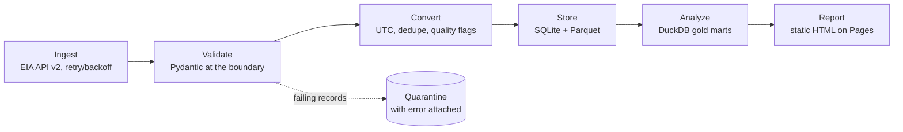

# GridPulse

[](https://github.com/evanderpool/gridpulse/actions/workflows/ci.yml)
[](https://github.com/evanderpool/gridpulse/actions/workflows/pipeline.yml)

**▶ Live report: https://evanderpool.github.io/gridpulse/**

**A live view of the U.S. electricity grid** — hourly demand and fuel mix for
four major grid regions (ERCOT, CAISO, MISO, PJM), pulled from the
[EIA open-data API v2](https://www.eia.gov/opendata/), tamed by a documented
deterministic conversion tool, and published as a self-refreshing report.

> **Status: MVP — phases 0–3 shipped.** The full pipeline runs on a 2×/day
> GitHub Actions cron: incremental ingest → bronze (orphan `data` branch) →
> validated, quality-flagged silver → gold metrics → the static report above,
> republished to Pages every run. Every phase passed sequential adversarial
> reviews (logic + code) with all findings fixed and pinned as regression
> tests. This README was written before the code on purpose: it is the spec,
> and it is kept current.

## The three questions

The whole product exists to answer exactly three business-style questions.
Anything that doesn't serve one of them is out of scope.

1. **Renewables share** — What share of each region's electricity came from
   wind and solar this month, and how has that mix shifted year over year?
2. **Peaks** — When does each grid peak, and how do daily demand curves differ
   across regions and seasons?
3. **The duck curve** — How deep is the midday net-load valley and how steep is
   the evening ramp in solar-heavy grids like California?

## Architecture

Six stages, one-directional flow. Each stage reads only the previous stage's
output — the report never touches the API.



- **Bronze** — every API response saved verbatim, stamped with fetch time.
  Any conversion bug can be replayed against history without re-hitting the
  API. Bronze lives on the orphan `data` branch, never on `main`.
- **Silver** — validated, converted, deduplicated tables (SQLite for upserts,
  Parquet for analytics).
- **Gold** — aggregates that answer the three questions, plus a per-run
  metrics ledger (row counts, quarantine rate, freshness, git SHA).

### Module map

Entries marked with the phase that ships them; unmarked = built.

```
src/gridpulse/
  config.py          settings, API params, pull budget (env-driven)
  client.py          EIA calls, retry/backoff, pagination, bronze writes
  schemas/           raw.py + clean.py — Pydantic models
  convert/
    backends/        [Phase 2] base.py (interface) · polars · pandas [stretch]
    temporal.py      timestamp parsing, UTC normalization
    flatten.py       [Phase 2] nested JSON → tabular records
    quality.py       [Phase 2] null/outlier policy, quality flags
    dedupe.py        [Phase 2] natural-key dedup module (survivorship lives
                     in storage upserts today)
    derive.py        [Phase 2] renewable share, net load, ramp rate
    pipeline.py      the one public conversion entry point
  storage.py         bronze reader, silver upserts, quarantine, run ledger
  analyze.py         gold aggregates: the three questions, answered in SQL
  report.py          the static HTML report (reads the DB, never the API)
  cli.py             ingest --dataset · transform · derive · report · backfill
```

## Design decisions

- **Deterministic core.** The conversion tool is standalone, testable,
  reproducible code — not an AI call. (An optional AI "analyst notes"
  paragraph at the reporting edge is a stretch item, clearly labeled.)
- **Deliberately absent:** Airflow, Docker, Postgres, dbt. One DAG with one
  path doesn't need an orchestrator; right-sizing is the point. GitHub
  Actions cron (2×/day) is the scheduler.
- **$0 running cost, enforced in code:** incremental fetch windows, a
  `MAX_REQUESTS_PER_RUN` hard cap, exponential backoff with a circuit
  breaker. The report and dashboard never call the API.
- **Nothing fails silently:** failing records are quarantined with the error
  attached, quality thresholds auto-open GitHub Issues, and every run appends
  to a metrics ledger keyed by git SHA so improvements are attributable.

## Known data quirks (validated live, 2026-08-15)

Captured during pre-build validation; each is a named test fixture in
`tests/fixtures/`:

| Quirk | Consequence |
|---|---|
| CAISO solar reports **negative values at night** (≈ −60 MWh, station service) | naive renewable-share math ingests negative generation → explicit null/outlier policy |
| Fuel-type vocabulary **differs per region** (ERCOT reports `BAT`, CAISO sample did not) | schemas must not hardcode one fuel list |
| Every response carries a generic 5,000-row "incomplete return" warning | warnings ≠ errors; pagination is mandatory |
| Hourly periods are **UTC** (`2026-08-13T18`) | normalize internally, localize only at the reporting edge |

## Scope

- **Regions:** ERCOT (`ERCO`), CAISO (`CISO`), MISO (`MISO`), PJM (`PJM`)
- **Backfill window:** 13 months (enables year-over-year with one month of slack)
- **Cadence:** 2 pulls/day, incremental windows with revision overlap

## Roadmap

| Phase | Ships | Status |
|---|---|---|
| 0 | Repo skeleton, validated source, fixtures, CI | ✅ 2026-08-15 |
| 1 | Vertical slice: ingest → bronze → validate → convert → SQLite, idempotency proven by test; two adversarial review passes applied + pinned | ✅ 2026-08-15 |
| 2 | Full conversion suite, quarantine, metrics ledger; quality policy live (negative solar flagged, battery charge named); swappable Polars backend behind per-engine contract tests | ✅ 2026-08-16 |
| 3 | Gold marts, HTML report, Actions cron (2×/day), Pages — **MVP ship**, `v1.0-baseline` tagged | ✅ 2026-08-16 |
| 4+ | Stretch, strictly in order: Streamlit dashboard → quality panel → pandas backend → weather join → AI notes → suggestion engine | |

## Running locally

```
pip install -e .[dev]
pytest                                        # fully offline — 60+ tests
gridpulse ingest --start 2026-08-14T00 --end 2026-08-15T00   # both datasets
gridpulse transform                           # idempotent; re-run freely
gridpulse derive                              # silver → gold metrics
```

The dataframe engine behind `derive` is selected with `GRIDPULSE_BACKEND`
(default `polars`) — the swappable-backend design's one config line.

An EIA API key (free) goes in `.env` (gitignored) as `EIA_API_KEY=...` —
never in the repo, and a GitHub Actions secret in CI.

## License

MIT
